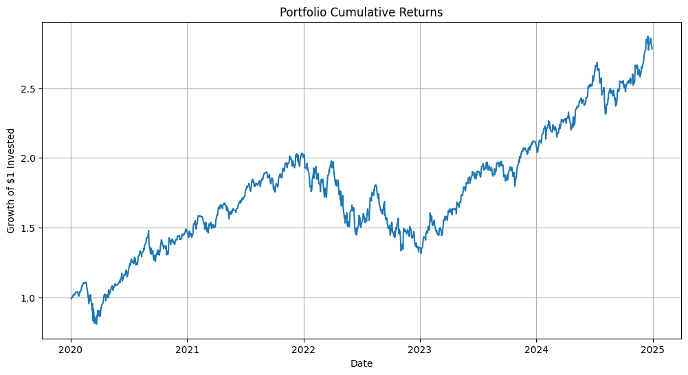
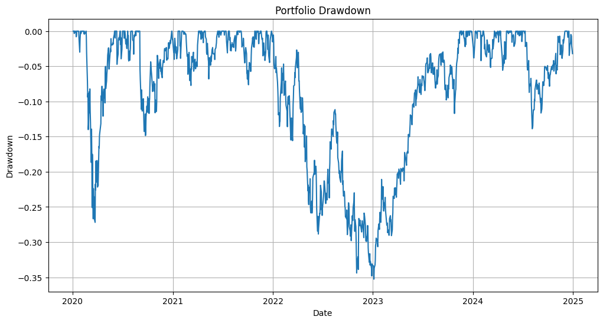

# Portfolio Risk & Performance Analysis

## Project Overview

This project analyzes the risk and performance of a multi-asset portfolio using Python.

The objective is to compute and visualize key portfolio metrics such as returns, volatility, cumulative performance, drawdown and Sharpe Ratio.

## Tools Used

- Python
- pandas
- NumPy
- matplotlib
- yfinance

## Main Features

- Download historical price data
- Compute daily returns
- Analyze asset volatility
- Build an equally weighted portfolio
- Compute portfolio cumulative returns
- Calculate drawdown
- Calculate Sharpe Ratio
- Visualize portfolio performance

## Financial Concepts Covered

- Daily returns
- Volatility
- Portfolio return
- Portfolio risk
- Drawdown
- Sharpe Ratio

## Project Structure

```text
portfolio-risk-analysis/
│
├── data/              # Datasets used in the project
├── images/            # Charts and visual outputs
├── notebook/          # Jupyter notebook with the analysis
├── src/               # Python scripts and reusable functions
├── .gitignore         # Files and folders ignored by Git
├── README.md          # Project description
└── requirements.txt   # Required Python libraries

## Results

The project analyzes an equally weighted portfolio composed of:

- AAPL
- MSFT
- GOOGL
- AMZN
- SPY

The main portfolio metrics computed are:

- Annual Return
- Annual Volatility
- Sharpe Ratio
- Maximum Drawdown

The final results are saved in:

```text
data/portfolio_summary.csv
```

## Visualizations

The project also generates two main charts:

```text
images/portfolio_cumulative_returns.png
images/portfolio_drawdown.png
```

### Portfolio Cumulative Returns



### Portfolio Drawdown


